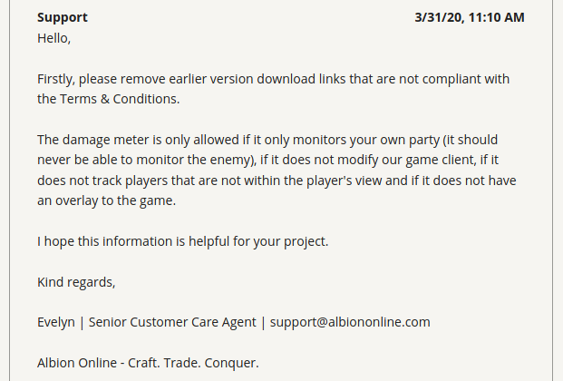

<p align="center">
    
</p>

Linux and OS X Build Status: [](https://travis-ci.org/mazurwiktor/albion-online-stats)

Windows Build Status: [](https://ci.appveyor.com/project/mazurwiktor/albion-online-stats)


[](https://discord.gg/3U2rpyV)

Albion Online Stats
===================

Albion online stats is an extension to MMORPG game - Albion Online. It tracks network traffic and displays various statistics, such as damage and DPS meter calculated from in-game actions.


# How to use this app

> **Note** this section does not require any coding knowledge. Those simple two steps are required to use this software :)

## Installation

1. On windows make sure that WinPcap is installed in your system. [Npcap 0.9983 installer for Windows Vista/2008, 7/2008R2, 8/2012, 8.1/2012R2, 10/2016 (x86 and x64)](https://nmap.org/npcap/dist/npcap-0.9983.exe) **Make sure to install with the "Install Npcap in WinPcap API-compatible Mode"**
2. Download latest release from https://github.com/mazurwiktor/albion-online-stats/releases/latest (.exe for windows .tar for linux and mac)
3. Enjoy :)

## Configuration

After first execution the app is going to create default configuration file named `albion-online-stats.cfg`. Feel free to edit it according to your needs.

## Is This Allowed
<p align="center">
    
</p>

- [x] Tracks your **own** party only
- [x] Doesn't provide overlay

> **Note** this traits of the application are true from version 0.9.0+.

## Donate

[](https://www.patreon.com/wiktormazur)


# Getting started

## Prerequisites

- Rust installed (https://www.rust-lang.org/tools/install)
- Python installed (python3.5 / python3.6 / python3.7)
- *Windows only prerequisites*  https://github.com/libpnet/libpnet#windows


## All platforms
1. Clone repository:
    ```shell
    git clone https://github.com/mazurwiktor/albion-online-stats.git
    ```
2. [optional] Create and activate python virtualenv

    ```shell
    python -m venv env
    [linux/mac] . env/bin/activate
    [windows] .\env\Scripts\activate.ps1
    ```

    or alternatively using conda and skip installing requirements step

    ```shell
    conda env create --file application/environment.yml
    conda activate albion
    ```

3. Install requirements (backend will be compiled during requirements installation)

    ```shell
    pip install -v -r application/requirements.txt
    ```

4. Run the application
    ```shell
    [sudo on linux] python application/albion-online-stats.py
    ```

# Contribution

Check out [wiki page](https://github.com/mazurwiktor/albion-online-stats/wiki)


# License
Licensed under either of

  * Apache License, Version 2.0, ([LICENSE-APACHE](LICENSE-APACHE) or http://www.apache.org/licenses/LICENSE-2.0)
  * MIT license ([LICENSE-MIT](LICENSE-MIT) or http://opensource.org/licenses/MIT)

at your option.
